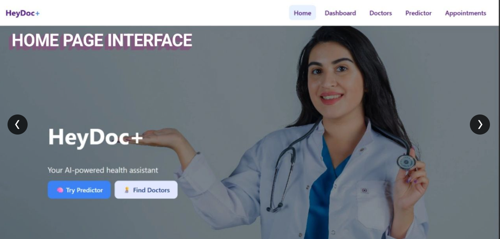
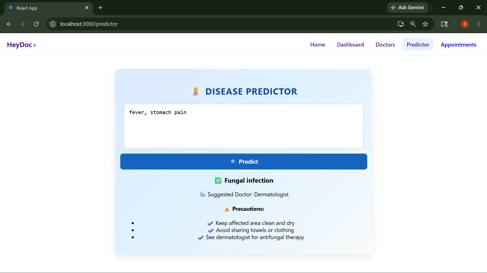
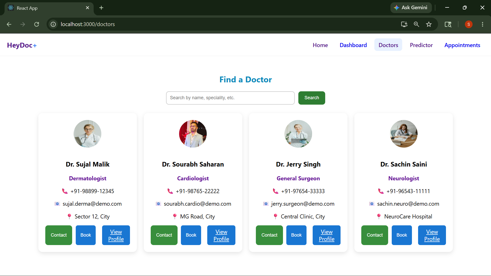
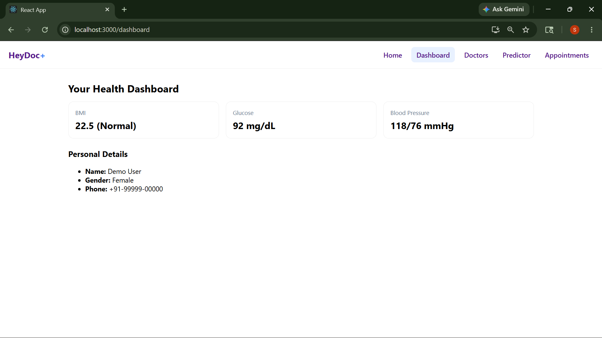
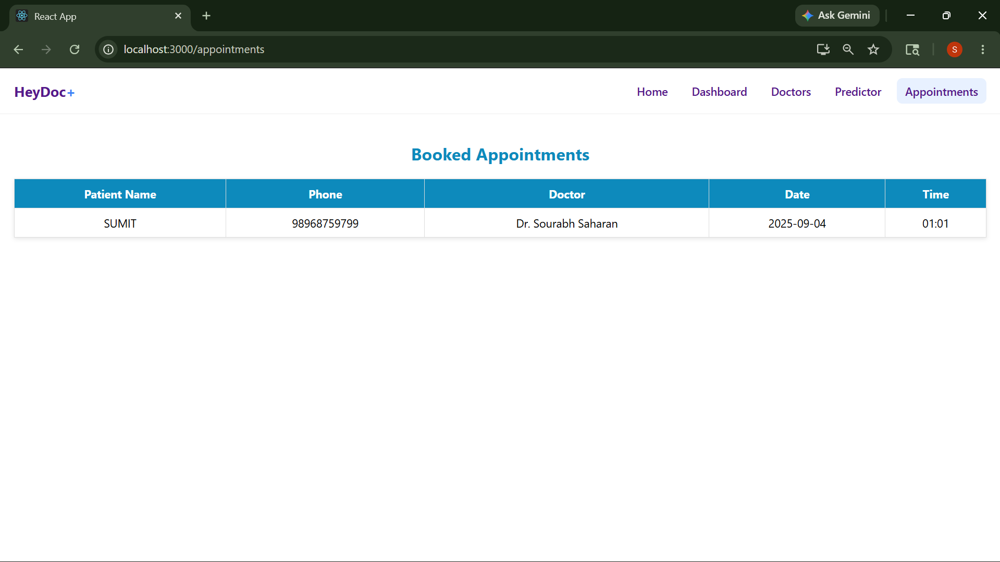

# Disease Prediction System

## 📌 Overview

Disease Prediction System is a machine learning based web application that predicts possible diseases based on symptoms entered by the user.

The system analyzes symptoms using a trained machine learning model and provides prediction results along with recommendations.

---

## 🚀 Features

- Symptom based disease prediction
- Machine learning integration
- User friendly interface
- Backend API integration
- Recommendation system
- Responsive frontend
- Dashboard and analytics pages
- Doctor recommendation flow
- Appointment related pages

---

## 🛠 Tech Stack

### Frontend
- React.js
- JavaScript
- HTML
- CSS

### Backend
- Node.js
- Express.js

### Machine Learning
- Python
- Scikit-learn
- Pandas
- NumPy
- Pickle

### Database
- MongoDB

---

## ⚙️ How It Works

1. User enters symptoms
2. Frontend sends data to backend
3. Backend communicates with ML service
4. ML model predicts disease
5. Result is displayed to the user

---

## 📂 Project Structure

```bash
Disease_prediction/
│
├── backend/
├── frontend/
├── ml_service/
├── assets/
│   ├── appointments.png
│   ├── dashboard.png
│   ├── doctors_page.png
│   ├── home_page.png
│   └── predictors.png
└── README.md
```

---

## 📸 Screenshots

### Home Page


### Predictors Page


### Doctors Page


### Dashboard


### Appointments Page


---

## 🔧 Setup Instructions

### Frontend

```bash
cd frontend
npm install
npm start
```

### Backend

```bash
cd backend
npm install
npm start
```

### ML Service

```bash
cd ml_service
python app.py
```

---

## 📌 Notes

- Make sure MongoDB is running before starting backend services.
- Run frontend, backend, and ML service together for complete functionality.
- Ensure required Python packages are installed before running ML service.

---

## 🔮 Future Improvements

- More accurate prediction models
- Doctor consultation integration
- User authentication
- Medical history tracking
- Online deployment
- Real-time analytics dashboard

---

## 👨‍💻 Author

### Sourabh Saharan

GitHub: https://github.com/SourabhSaharan
